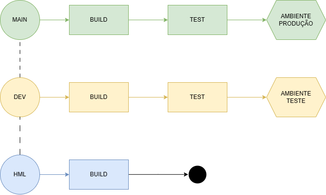

# Leia-me
    MVP de CI/CD para NodeJS e Testes com o Jest;
    As versões utilizads do NodeJS são 20 e 22; sendo definidas por Pipelines, sendo main e dev utiliza a versao 20 e hml versão 22.2.0.
    São 02 ambientes de Produção e Desenvolvimento e 
    03 branch sendo: main, dev e hml; 
    As branch de main e dev, utilizam os ambientes de Produção e Desenvolvimento, e branch de hml não utliza ambiente;
   
# Ferramentas
    Repo GitHub
    Deploy utilizando GitHubActions
    Setup NodeJS 20 e 22
    Codespaces
    Teste com Jest
    Babel

# Estrategia de Ambientes e Branch
    São 03 Branch: [main, dev, hml] 
    Branch *Main* realiza o build do NodeJS 20, teste com Jest, e deploy no Servidor de Produção;
    Branch *Dev* realiza o build do NodeJS 20, teste com Jest, e deploy no Servidor de Desenvolvimento;
    Branch *Hml* realiza o build do NodeJS 22.2.0.

# Desenho da Branch e Ambientes

